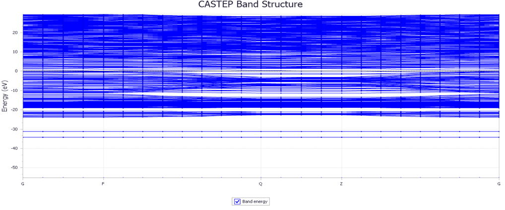

# 🧪 GaN-Ti Nanotube DFT Simulation

This repository contains a DFT(Density Functional Theory)-based simulation study of the structural, electronic, and elastic properties of Titanium-doped Gallium Nitride (GaN-Ti) in both bulk and nanotube forms. Simulations were performed using BIOVIA Materials Studio, and elastic tensor analysis was conducted using ELATE.

---

## 📄 Project Overview

- 🎯 Objective: Examine how Ti doping affects GaN’s band gap, elasticity, and structural integrity.
- 🧪 Tools Used:
  - BIOVIA Materials Studio (CASTEP, Forcite modules)
  - ELATE for elastic tensor visualization
  - OriginLab for graph plotting
- ⚙️ Methodology:
  - DFT (GGA-PBE) geometry optimization
  - Band structure, DOS, and elastic property evaluation
  - Visual analysis of stress–strain response via ELATE

---

## 🧬 Key Findings

- Ti-doping reduces the band gap of GaN, enhancing electronic conductivity.
- GaN-Ti nanotubes exhibit improved elastic strength and anisotropy.
- Elastic constants (C11, C12, C44) and moduli were derived and visualized in 3D using ELATE.

---

## 🖼️ Visual Summary

### 🧱 Optimized Structure

<p align="center">
  
</p>

### 📉 Band Structure

<p align="center">
  
</p>

### 📊 Density of States (DOS)

<p align="center">
  
</p>

### 🧪 Elastic Tensor (ELATE 3D View)

<p align="center">
  
</p>

---

## 📁 Repository Contents

| File                          | Description                                                 |
|-------------------------------|-------------------------------------------------------------|
| 📄 report.pdf                 | Full research report                                        |
| 📄 elastic_tensor_analysis.pdf | ELATE-based mechanical analysis                            |
| 📁 images/                    | PNG images of structures, graphs, and analysis              |
| 📄 README.md                  | This markdown document                                     |
| 📄 LICENSE                    | Optional license file (MIT recommended)                     |

---

## 🔍 Simulation Settings

| Parameter         | Value                         |
|-------------------|-------------------------------|
| Functional        | GGA (PBE)                     |
| Basis Set         | Plane-wave                    |
| Cutoff Energy     | 340–400 eV                    |
| K-point Grid      | 3×3×3                         |
| Optimization      | Full geometry optimization    |
| Elastic Analysis  | ELATE                         |

---

## 📌 Citation

```bibtex
@report{singh2025gan_ti,
  title={Structural, Electronic and Elastic Properties of GaN-Ti Bulk and Nanotubes},
  author={Kirti Vardhan Singh},
  year={2025},
  institution={Centurion University of Technology and Management}
}
```

---

## 📬 Contact

👤 Kirti Vardhan Singh  
📧 Email: kirtivardhan7549@gmail.com  
🏫 Department of Computer Science and Engineering  
Centurion University of Technology and Management, Bhubaneswar, India

---

<div align="center">
  Made with ❤️ for materials simulation and nanoscience.
</div>
```


